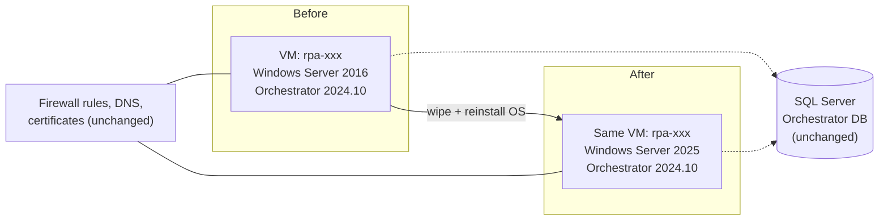
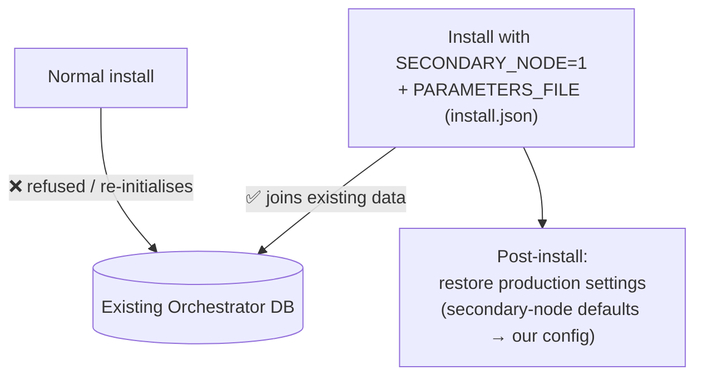
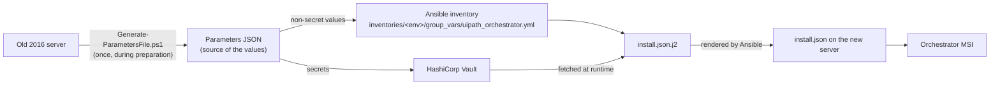
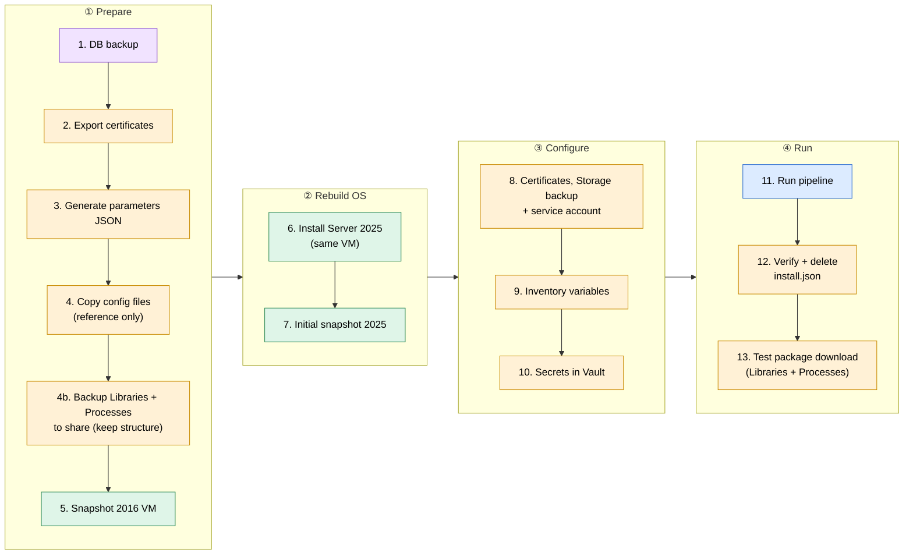
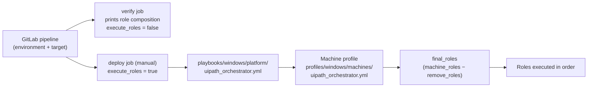
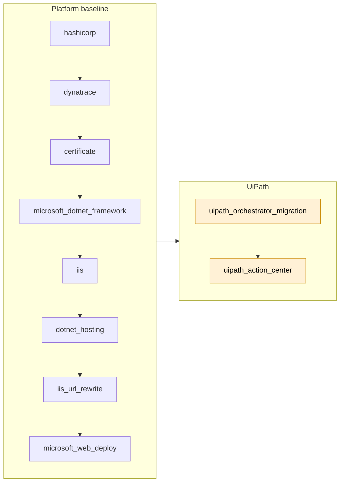
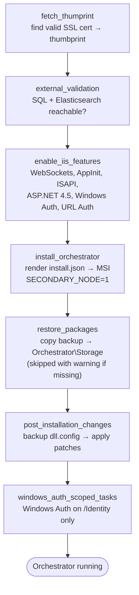
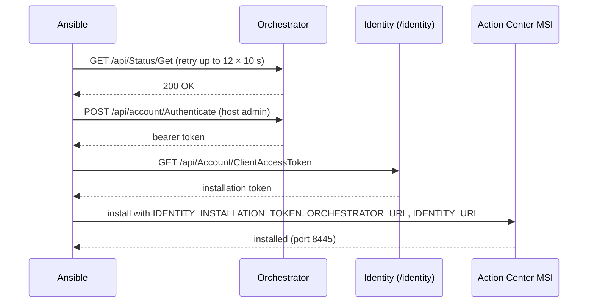
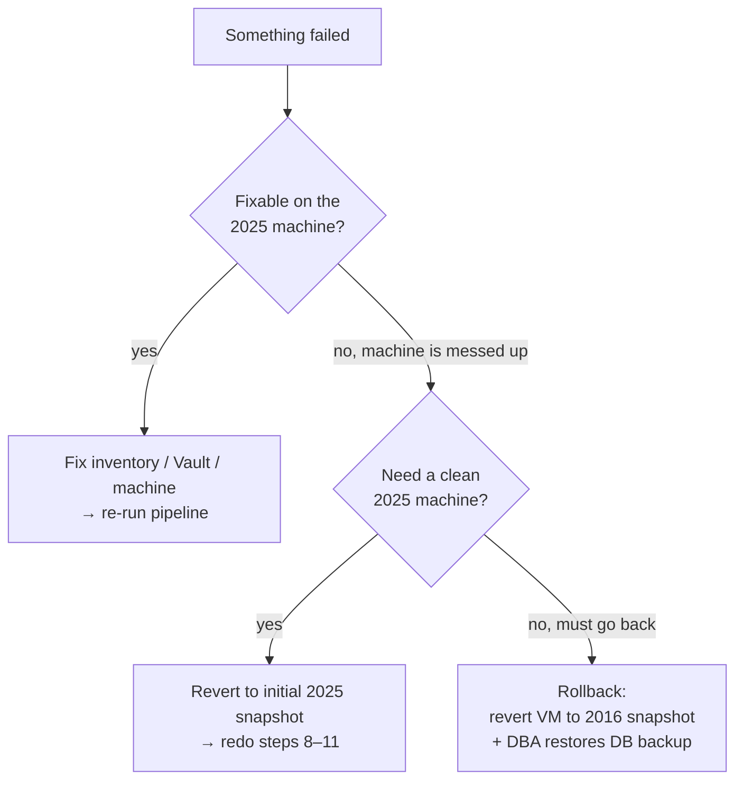

# UiPath Orchestrator — OS Migration (Server 2016 → 2025)

> **TL;DR** — We wipe the existing UiPath server, install Windows Server 2025 on the **same VM**, and let Ansible reinstall Orchestrator + Action Center against the **existing database** as a *secondary node*. Same hostname, same firewall rules, same data.

> [!WARNING]
> **This is a one-off procedure.** Use it only for an OS rebuild or to recover a crashed machine.
> **UiPath version upgrades are a separate process** — do not use this document for them.

The `uipath_orchestrator` machine hosts two products:

- **UiPath Orchestrator** (incl. Identity, Webhooks, Resource Catalog, Test Automation, Update Server)
- **UiPath Action Center**

---

## 1. Why

The servers run Windows Server 2016 and must move to 2025. Instead of building new machines, we reinstall the OS **in place**. That keeps hostname, IP, firewall rules, DNS and certificates mappings — nothing to re-request from other teams.



---

## 2. The catch — why not a normal install?

Orchestrator does **not** allow a fresh install against a database that already belongs to an instance — even when the old instance no longer exists. A normal install would try to initialise the DB again.

**Solution:** install the new server as a **secondary node** of the existing database. The installer then *joins* the existing data and keys instead of creating new ones.



The install command (from the software catalog `profiles/windows/software_catalog/uipath_platform.yml`):

```text
UiPathOrchestrator.msi SECONDARY_NODE=1 PARAMETERS_FILE="<install.json>" /passive /q /L*V <install log>
```

`install.json` carries everything the installer needs: connection strings, certificate, app pool account, encryption keys and the Identity client seed (`IdentitySeedInfo`). Ansible renders it from `roles/windows/uipath_orchestrator_migration/tasks/install.json.j2`.

**Where do the values come from?**



---

## 3. The big picture

Who does what, in which order.



**Colour = who does it:** 🟧 RPA team · 🟪 DBA team · 🟩 Windows team · 🟦 Ansible (pipeline). Steps 1, 5 and 6 are requested by the RPA team by email.

---

## 4. Preparation checklist

| # | Step | Who | Result / where it goes |
|---|------|-----|------------------------|
| 1 | Request database backup | RPA → DBA | DB backup (rollback point) |
| 2 | Export certificates (with private key) | RPA | `.pfx` files, stored safely |
| 3 | Generate parameters JSON with `Generate-ParametersFile.ps1` (UiPath tools folder) | RPA | Source of values for inventory + Vault |
| 4 | Copy config files from the old server: `UiPath.Orchestrator.dll.config`, Identity `appsettings.Production.json`, ResourceCatalog `appsettings.Production.json`, `web.config` | RPA | **Reference only** — to compare if something looks wrong later |
| 4b | Check that **no jobs are suspended** (their state is not migrated). Back up `Orchestrator-Host\Libraries` and **every tenant's** `Orchestrator-<uuid>\Processes` to the share, keeping the folder structure — use the snippet below. Nothing else (videos, execution media, logs, retention, job persistence). **Keep this backup after the migration.** | RPA | Storage backup on the share |
| 5 | Snapshot of the 2016 VM | Windows | Rollback point |
| 6 | Request OS installation | RPA → Windows | Windows Server 2025 on the same VM |
| 7 | Initial snapshot of the fresh 2025 VM | Windows | Clean restart point for re-runs |
| 8 | Copy certificates and the **Storage backup** to `C:\sources\uipath_migration\Storage`, add service account (local admin) | RPA | Machine ready for Ansible |
| 9 | Update `inventories/<env>/group_vars/uipath_orchestrator.yml` | RPA | Correct non-secret values |
| 10 | Validate configuration, add secrets to Vault | RPA | Secrets available at runtime |
| 11 | Run the playbook (pipeline) | RPA | Orchestrator + Action Center installed |
| 12 | Verify `install.json`, then **delete it manually** | RPA | No secrets left on disk |
| 13 | Download one package from **Packages → Libraries** and one from **Packages → Processes** (in each tenant). Both are restored by Ansible. | RPA | Package downloads work for new robots |

> [!IMPORTANT]
> `install.json` contains secrets (encryption keys, passwords, client secrets). It is intentionally kept after the run so you can verify it — **do not forget step 12.**

> [!NOTE]
> **Why Storage matters (step 4b / 13).** Orchestrator keeps package files on local disk (`STORAGE_TYPE=FileSystem`, `.\Storage`). The OS wipe deletes them, but the **database still lists them** — so packages appear in the UI but cannot be downloaded.
>
> - `Orchestrator-Host\Libraries` — host library feed (our tenant uses the host feed for libraries)
> - `Orchestrator-<uuid>\Processes` — tenant process packages (`<uuid>` = tenant key, same DB → same folder name)
>
> Existing robots keep working from their local NuGet cache. **New robots, a cleared cache, or an older package version will fail** until Storage is restored. Ansible (`restore_packages`) copies the whole backup back into `Orchestrator\Storage` — **whatever is in the backup gets restored**, so the backup decides the scope. Restoring later works at any time (verified on DEV), as long as the 4b backup is kept.

**Step 4b — backup snippet** (run on the old server; picks up every tenant, no uuid needed):

```powershell
$src = "C:\Program Files (x86)\UiPath\Orchestrator\Storage"
$dst = "\\<share>\uipath-<env>\Storage"
robocopy "$src\Orchestrator-Host\Libraries" "$dst\Orchestrator-Host\Libraries" /E
Get-ChildItem $src -Directory -Filter "Orchestrator-*" | Where-Object Name -ne "Orchestrator-Host" | ForEach-Object {
  robocopy "$($_.FullName)\Processes" "$dst\$($_.Name)\Processes" /E
}
```

*Optional check:* the `<uuid>` folder names are the tenant keys from the database — `SELECT Id, Name, [Key] FROM dbo.Tenants;` should list the same values. Same DB after the migration → same names. If one ever differed, robocopy would only create an extra, unused folder (nothing is overwritten) and step 13 would show it.

---

## 5. How Ansible runs it



Command used by the deploy job:

```bash
ansible-playbook -i inventories/<env> playbooks/windows/platform/uipath_orchestrator.yml -e execute_roles=true
```

> [!TIP]
> **Plan before apply.** Without `execute_roles=true` the playbook only prints *which* roles would run (the composition) and executes nothing. The verify job uses this so you can check the plan before the manual deploy job.

### Roles, in order



| Role | What it does |
|------|--------------|
| `hashicorp` | Reads the secrets for this environment from Vault (`vault_secret_path`) → `_vault_secret` |
| `dynatrace` | Installs the Dynatrace OneAgent with env-specific host group/tags |
| `certificate` | Imports the SSL certificate (`.pfx`) into `LocalMachine\My` if no valid one exists |
| `microsoft_dotnet_framework` | Installs .NET Framework 4.7.2 |
| `iis` | Installs the IIS Web Server feature and ensures `W3SVC` is running |
| `dotnet_hosting` | Installs the ASP.NET Core Hosting Bundle (8.0) |
| `iis_url_rewrite` | Installs IIS URL Rewrite 2 |
| `microsoft_web_deploy` | Installs Web Deploy 3 |
| **`uipath_orchestrator_migration`** | Installs Orchestrator as secondary node and applies post-install config — see below |
| **`uipath_action_center`** | Gets an installation token from Orchestrator and installs Action Center — see below |

The **platform baseline** roles are simple: a Vault lookup, a certificate import, and installs from the software catalog (download from JFrog → install → verify a marker file). Anything already installed is skipped automatically.

> [!NOTE]
> **Why are these roles in the profile and not in the playbook's `pre_tasks`?** The machine profile is the single list of what a machine contains, and the verify job prints exactly that list before anything runs. `pre_tasks` only prepares the play (load profile, compute `final_roles`).

---

## 6. Inside `uipath_orchestrator_migration`

Entry point: `roles/windows/uipath_orchestrator_migration/tasks/main.yml`



| Stage | Why it is needed |
|-------|------------------|
| `fetch_thumprint` | The installer needs the certificate **thumbprint**; it is read from the store at runtime, so the inventory only holds the subject. |
| `external_validation` | Fail fast if SQL Server (TCP + Windows auth) or Elasticsearch is not reachable — before touching the machine. |
| `enable_iis_features` | IIS features Orchestrator requires on top of the base `iis` role. |
| `install_orchestrator` | Renders `install.json` from inventory + Vault values and runs the MSI as secondary node. |
| `restore_packages` | The OS wipe deleted the package files, but the DB still lists them. Copies the backup (`uipath_packages_backup_path`: host libraries + each tenant's processes) into `Orchestrator\Storage` — no delete, permissions inherited, re-runs copy nothing. Runs only if the backup exists **and** Orchestrator is installed at the configured path; **otherwise warns and skips** — Orchestrator still runs, only new robots cannot download packages until restored. |
| `post_installation_changes` | A secondary-node install comes with secondary-node defaults. We restore our production settings in `UiPath.Orchestrator.dll.config` (Elasticsearch log targets, `AcceptedRootUrls`, video retention job, automatic DB migrations). Patches are listed in `defaults/main.yml`. The original file is kept once as `UiPath.Orchestrator.dll.config.pre-patch.bak`. |
| `windows_auth_scoped_tasks` | Windows Authentication must be enabled **only** on the `Identity` app. The root Orchestrator app stays Anonymous so `/api/account/authenticate` keeps working (Action Center needs it). Verified after an IIS restart. |

---

## 7. Action Center — why it logs in to Orchestrator first

Action Center needs an **Identity installation token**, and that token only exists once Orchestrator is running.



This is also why the root Orchestrator app must stay Anonymous (section 6): the `Authenticate` call would fail behind Windows Auth.

---

## 8. If something goes wrong

**Default strategy: roll forward.** Fix the cause and re-run. Every role checks what is already installed, so re-runs are safe.



Where to look first:

| Symptom | Check |
|---------|-------|
| Install step fails | MSI log (`uipath_orchestrator_install_log`), `install.json` values |
| Orchestrator up, logs / settings look wrong | Compare `UiPath.Orchestrator.dll.config` with `.pre-patch.bak` and the copy from step 4 |
| Action Center install fails at authentication | Windows Auth must be off at the Orchestrator root app (section 6) |
| Login / Identity problems | Identity client IDs in inventory, secrets in Vault, `IdentitySeedInfo` in `install.json` |

---

## Where things live

| What | Path |
|------|------|
| Playbook | `playbooks/windows/platform/uipath_orchestrator.yml` |
| Machine profile (role list + packages) | `profiles/windows/machines/uipath_orchestrator.yml` |
| Software catalog (MSI arguments) | `profiles/windows/software_catalog/uipath_platform.yml` |
| Environment variables | `inventories/<env>/group_vars/uipath_orchestrator.yml` |
| Migration role | `roles/windows/uipath_orchestrator_migration/` |
| Action Center role | `roles/windows/uipath_action_center/` |
| dll.config patches | `roles/windows/uipath_orchestrator_migration/defaults/main.yml` |
