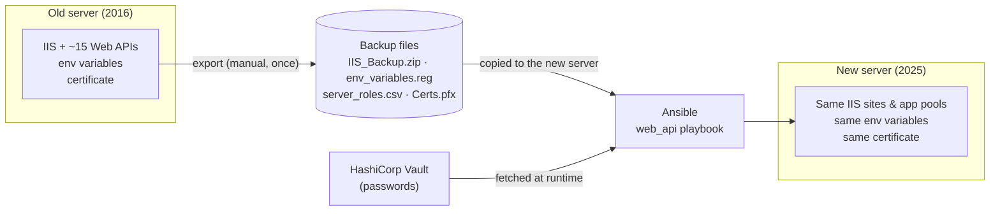
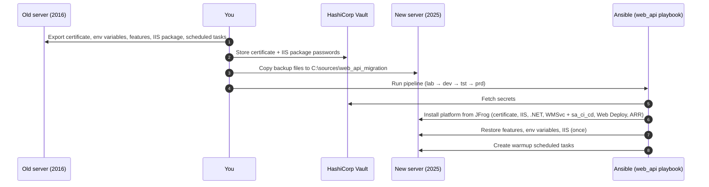
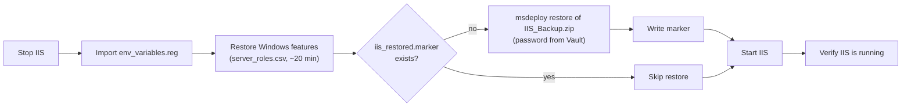

# Web API — OS Migration (Server 2016 → 2025)

> **TL;DR** — We back up the old Web API server (IIS, certificate, environment variables, Windows features), build a fresh Windows Server 2025 machine, and let Ansible install the platform and restore IIS in one run — instead of reinstalling ~15 applications one by one. GitLab keeps deploying through Web Deploy, exactly as before.

> [!WARNING]
> **This is a one-off procedure** to move from Server 2016 to 2025 (or to rebuild a crashed machine).
> Day-to-day changes — new certificates, environment variables, application deployments — go through their dedicated Ansible roles and GitLab CI/CD pipelines, **not** through this migration.

The `web_api` machine hosts the .NET Web APIs deployed from GitLab CI/CD into IIS.

---

## 1. Why

The Web API servers run Windows Server 2016 and must move to 2025. Rebuilding them by hand means reconfiguring certificates, environment variables, Windows features and reinstalling every application — slow and error-prone.

Instead we **capture the old server's state once**, and Ansible **reproduces it** on the new machine: same IIS sites, app pools, bindings and configuration; same environment variables; same Windows features.



---

## 2. The catches — what makes this more than "install IIS"

### 2.1 IIS is restored as a whole, not app by app

The old server's complete IIS configuration (sites, app pools, bindings, application files) is exported into **one encrypted Web Deploy package** and restored on the new server with `msdeploy -verb:sync`.

Restoring over a live server would overwrite it, so the restore is guarded by a **marker file**: once `C:\sources\web_api_migration\iis_restored.marker` exists, the restore is skipped on every later run. A failed restore does **not** write the marker, so the next run retries it.

### 2.2 Web Management Service (WMSvc) — how GitLab deploys

GitLab deploys the applications **remotely**: Web Deploy (msdeploy) connects to the **Web Management Service on port 8172** of the server, signed in as the CI/CD account `sa_ci_cd`.

The role `web_management_service` sets this up — feature, certificate, remote access, firewall, and `sa_ci_cd` in the local Administrators group. It runs **before** Web Deploy is installed, because Web Deploy only hooks into WMSvc if WMSvc already exists.

**Like-for-like:** same as the old server — self-signed `WMSvc-SHA2` certificate, built-in firewall rule (port 8172, internal network), `sa_ci_cd` as local administrator. Nothing changes for the pipelines.

### 2.3 Warmup scheduled tasks — no more ps1

On the old server, scheduled tasks run a **ps1 script** that calls the APIs' Swagger pages to keep them warm. On the new server the tasks call the URLs **directly** — the URLs and times live in the inventory (`scheduled_tasks` in group_vars), so they are reviewed in Git and differ per environment. See [4.5](#45-scheduled-tasks) for how to find them on the old server.

### 2.4 Environment variables come from the old server

`env_variables.reg` is imported as-is. It contains all machine environment variables of the old server, **including `Path`** — so the old server's `Path` **overrides** the one the installers just set on the new server. That is fine as long as the same software is installed on both servers, which is the case for this migration.

---

## 3. The big picture



---

## 4. Backup — on the old server

Run on the **old machine** before migration. Store all files in `backup_<hostname>_<date>` on the backup machine.

### 4.1 Certificate
1. Run `certlm.msc` (Local Computer store — **not** `certmgr.msc`, which opens the Current User store)
2. Personal → Certificates → right-click the Web API certificate → All Tasks → Export
3. "Yes, export the private key", set a strong password
4. Save as **`Certs.pfx`**
5. **Store the password in HashiCorp Vault (`certificate`) — nowhere else**

### 4.2 Environment variables
1. Run `regedit`
2. Navigate to `HKEY_LOCAL_MACHINE\SYSTEM\CurrentControlSet\Control\Session Manager\Environment`
3. Right-click `Environment` → Export → save as `env_variables.reg`

### 4.3 Windows features
```powershell
Get-WindowsFeature |
  Where-Object { $_.InstallState -eq 'Installed' } |
  Select-Object Name |
  Export-Csv -Path "C:\sources\web_api_migration\server_roles.csv" -NoTypeInformation
```

### 4.4 IIS (sites, app pools, applications)
```powershell
iisreset /stop /force

cd "C:\Program Files\IIS\Microsoft Web Deploy V3"
.\msdeploy.exe -verb:sync `
  -source:webServer `
  "-dest:package='C:\sources\web_api_migration\IIS_Backup.zip',encryptPassword='yourpassword'"

iisreset /start
```
> IIS is stopped during the export — plan a short downtime on the old server.

**Store the encrypt password in HashiCorp Vault (`iis_backup`) — nowhere else.**

### 4.5 Scheduled tasks
List every task that runs a ps1, with its command and schedule:
```powershell
Get-ScheduledTask | Where-Object { $_.Actions.Arguments -match '\.ps1' } |
  Select-Object TaskName, TaskPath, State,
    @{n='Command';  e={ ($_.Actions  | ForEach-Object { "$($_.Execute) $($_.Arguments)" }) -join '; ' }},
    @{n='Schedule'; e={ ($_.Triggers | ForEach-Object { "$($_.StartBoundary) every $($_.Repetition.Interval) for $($_.Repetition.Duration)" }) -join '; ' }} |
  Format-List
```
(GUI: `Win+R` → `taskschd.msc` → Task Scheduler Library → task → **Actions** / **Triggers** tabs.)

Open each ps1, note the URLs it calls, and copy URL + start time + interval + duration into `scheduled_tasks` in `inventories/<env>/group_vars/web_api.yml`:
```yaml
scheduled_tasks:
  - name: "warmup api1"
    url: "{{ base_url }}/web-api1/swagger/index.html"
    start_time: "2024-01-01T04:00:00"
    interval: PT15M
    duration: PT12H
```

### 4.6 Collect the files
```
backup_<hostname>_<date>\
  ├── Certs.pfx
  ├── env_variables.reg
  ├── server_roles.csv
  └── IIS_Backup.zip
```

---

## 5. Pre-migration checklist — on the new server

| Step | Description | Done |
|---|---|---|
| Snapshot | VM snapshot of the new machine before starting | ☐ |
| Windows Update | Reboot once after first boot and let Windows Update finish. If an install still fails with *"another program is being installed"* (1618), just re-run — finished roles are skipped | ☐ |
| SSH | `ssh username@hostname` works | ☐ |
| Inventory | Host listed under `web_api` in `inventories/<env>/hosts.yml` | ☐ |
| group_vars | `inventories/<env>/group_vars/web_api.yml`: certificate subject, Dynatrace, `vault_secret_path`, `base_url`, `scheduled_tasks`, `web_management_service_deploy_accounts` (`MAIN\sa_ci_cd`) | ☐ |
| Vault | `certificate` and `iis_backup` exist at `vault_secret_path` | ☐ |
| Backup files | The 4 files in `C:\sources\web_api_migration\` | ☐ |

Always promote in this order — never skip an environment:
```
lab → dev → tst → prd
```

---

## 6. How Ansible runs it

Playbook `playbooks/windows/platform/web_api.yml` loads the machine profile `profiles/windows/machines/web_api.yml` and runs its `machine_roles` in order.

### Roles, in order

| # | Role | What it does |
|---|---|---|
| 1 | `prepare_folders` | Creates base folders + `C:\sources\web_api_migration` |
| 2 | `hashicorp` | Fetches secrets from Vault (`certificate`, `iis_backup`) |
| 3 | `git` | Git 2.48.1 |
| 4 | `dynatrace` | Dynatrace OneAgent with the environment's host properties |
| 5 | `certificate` | Imports `Certs.pfx` into LocalMachine\My |
| 6 | `iis` | Ensures IIS is installed and running |
| 7 | `iis_url_rewrite` | URL Rewrite module |
| 8 | `dotnet_hosting` | .NET hosting bundles 8.0.13 and 10.0.1 |
| 9 | `web_management_service` | WMSvc: feature, certificate, remote access, `sa_ci_cd` as local admin, firewall, restart — see [§7](#7-inside-web_management_service) |
| 10 | `microsoft_web_deploy` | Web Deploy **with the WMSvc handler** (`microsoft-web-deploy-v3-wmsvc`) |
| 11 | `request_router` | Application Request Routing (ARR) |
| 12 | `web_api_migration` | Restores features, env variables and IIS — see [§8](#8-inside-web_api_migration) |
| 13 | `scheduled_tasks` | Warmup tasks from `scheduled_tasks` in group_vars |

Software installs go through the software catalog (`profiles/windows/software_catalog/`): a role is skipped when its check path already exists, so re-running only installs what's missing.

---

## 7. Inside `web_management_service`

| Step | What | Why |
|---|---|---|
| 1 | Enable the `Web-Mgmt-Service` feature | Creates WMSvc and the `WMSvc-SHA2` certificate |
| 2 | Check WMSvc exists | Fail early with a clear message |
| 3 | Registry: `EnableRemoteManagement=1`, `RequiresWindowsCredentials=1` | Remote deploys with a Windows (local admin) account |
| 4 | Add `web_management_service_deploy_accounts` (`MAIN\sa_ci_cd`) to local **Administrators** | GitLab signs in as `sa_ci_cd`; without admin rights every deploy is *access denied* |
| 5 | Connect the certificate: `SslCertificateHash` + 8172 binding (app id `{d7d72267-…}`) | Windows creates the certificate but doesn't connect it — without this WMSvc won't start. Changes only what's wrong; a second run reports *unchanged* |
| 6 | Enable the built-in firewall rule "Web Management Service (HTTP Traffic-In)" | Like the old server: port 8172, any internal address |
| 7 | Restart WMSvc (stop + start, automatic) | WMSvc reads its settings only at startup |
| 8 | Wait for port 8172 | A service that only *looks* started doesn't pass |

> [!TIP]
> **If the role fails at "Start Web Management Service":** open IIS Manager → server → **Management Service** → select **WMSvc-SHA2** as SSL certificate → **Apply** → **Start**. Then re-run the playbook; the certificate step should report *unchanged*.

---

## 8. Inside `web_api_migration`



> [!NOTE]
> Only the IIS restore is protected by the marker. A re-run still stops IIS and re-imports the environment variables — **safe to re-run during the migration, don't re-run against a server that is already live.**

---

## Where things live

| What | Where |
|---|---|
| Playbook | `playbooks/windows/platform/web_api.yml` |
| Machine profile (roles, software) | `profiles/windows/machines/web_api.yml` |
| Environment settings | `inventories/<env>/group_vars/web_api.yml` |
| Hosts | `inventories/<env>/hosts.yml` (group `web_api`) |
| Migration role | `roles/windows/web_api_migration/` |
| WMSvc role | `roles/windows/web_management_service/` |
| Warmup tasks role | `roles/windows/scheduled_tasks/` |
| Software catalog | `profiles/windows/software_catalog/` |
| Backup files on the new server | `C:\sources\web_api_migration\` |
| Installers | JFrog, via the software catalog |
| Secrets | HashiCorp Vault, `vault_secret_path` (`certificate`, `iis_backup`) |
